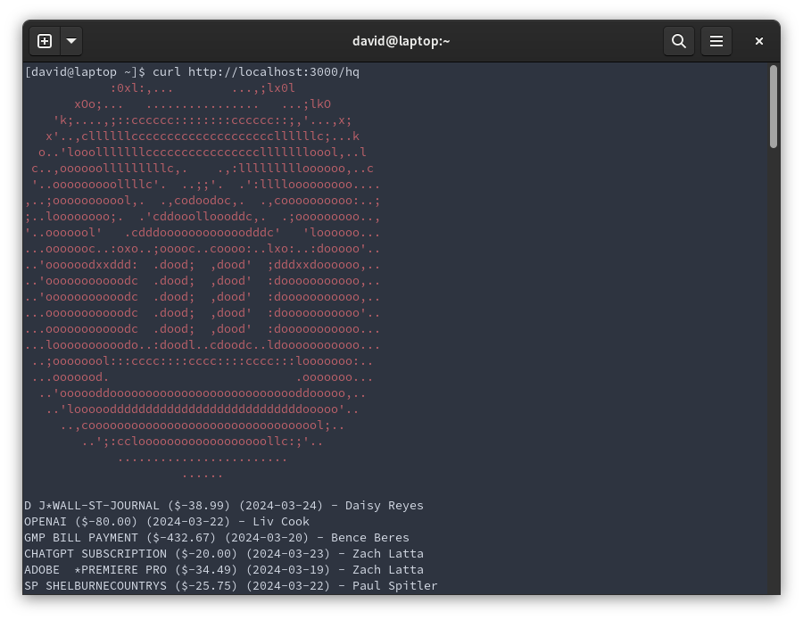
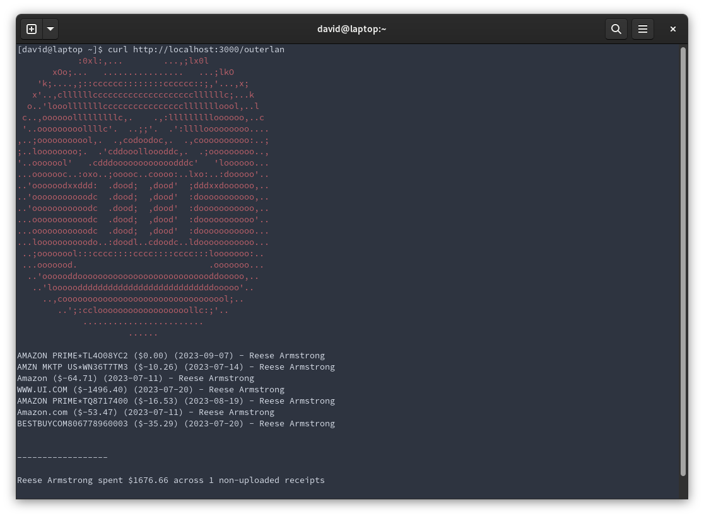

# hcbmissingreceipts

Now you can see who exactly is missing the most receipts with a curl. Heavily inspired by @reesericci's [bancurl](https://sr.ht/~reesericci/hackclub-bancurl/)

Due to the way the HCB API works, it does take a bit more to get each missing receipt, so please be paitent. Running it against the HQ account with a 10 page limit gives the following:

```bash
real	1m0.618s
user	0m0.003s
sys	    0m0.003s
```




Try it out!

```
curl https://receipts.curl.aboutdavid.ninja/org-id
```
